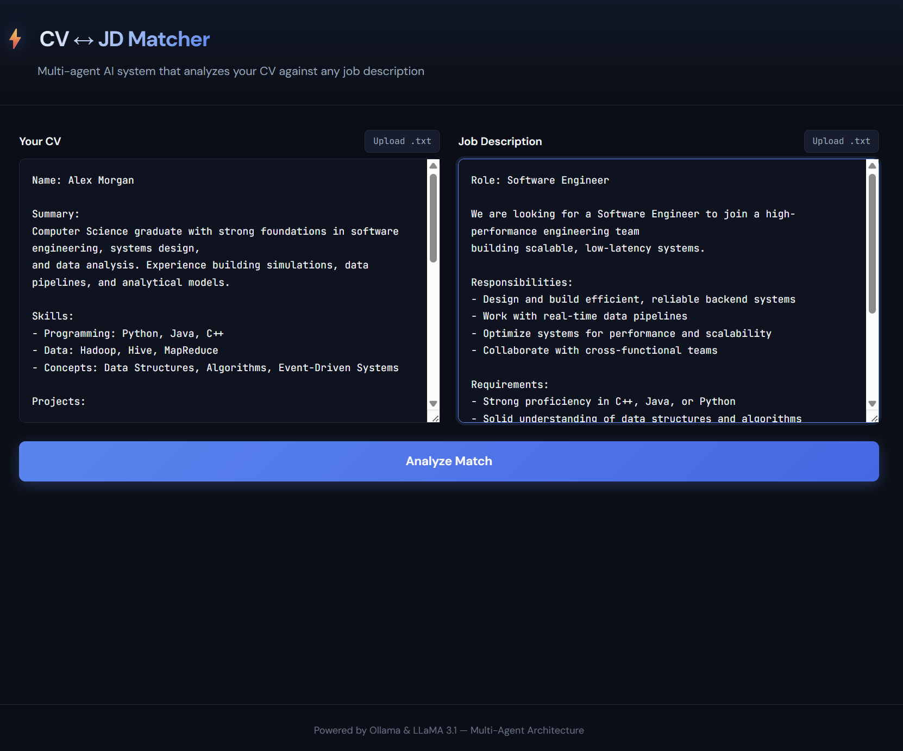
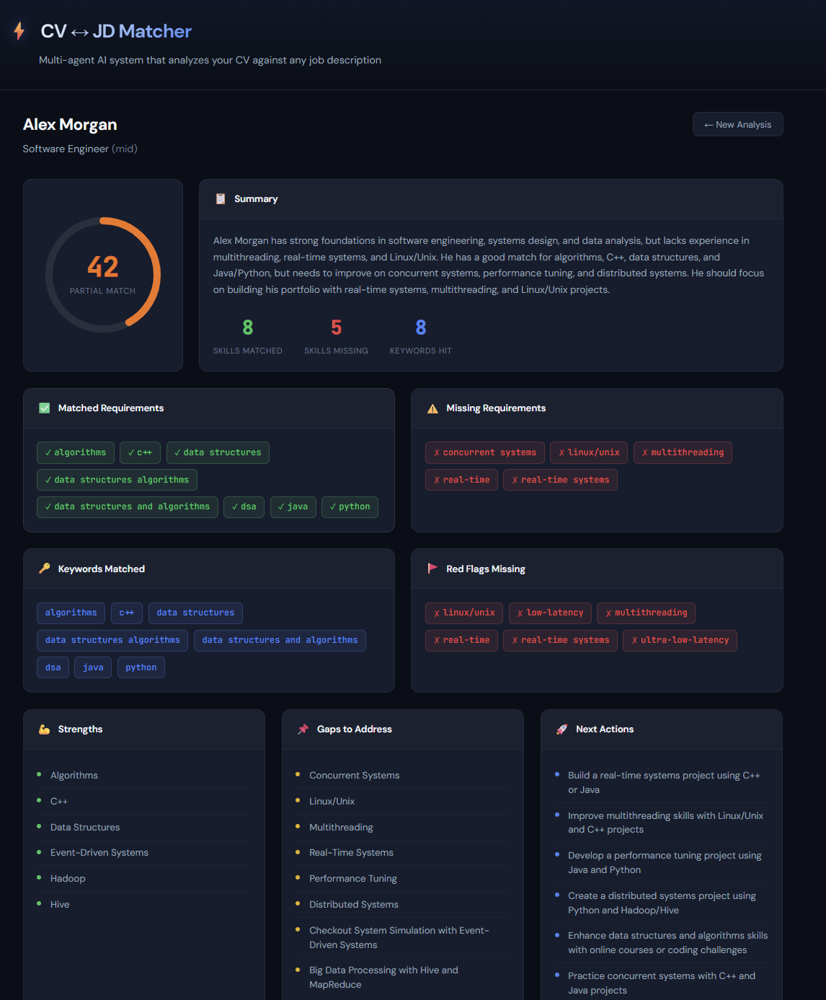
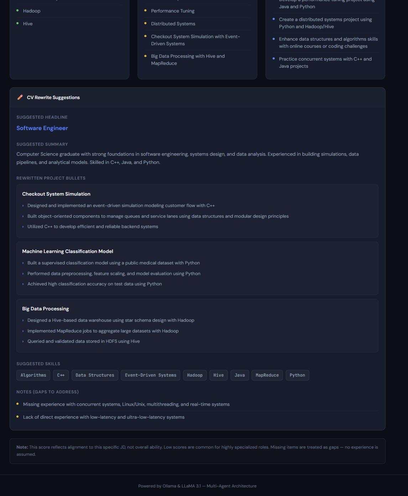

# ⚡ JobFit — Multi-Agent CV ↔ JD Matcher

> An AI-powered multi-agent system that analyzes your CV against any job description — built with React, FastAPI, and local LLMs via Ollama.


---

## 📌 About

JobFit uses a **multi-agent architecture** where specialized AI agents collaborate to provide a comprehensive analysis of how well your CV matches a target job description. Everything runs **locally** — no data is sent to external APIs.

### What It Does

- **Parses** your CV and job description into structured data using dedicated AI agents
- **Scores** the match with a transparent, weighted scoring system
- **Identifies** matched skills, missing requirements, and keyword coverage
- **Advises** on strengths, gaps, and actionable next steps
- **Rewrites** CV bullet points to better align with the JD — without inventing experience

---

## 🖥️ Screenshots





---

## 🏗️ Architecture

The system uses five specialized agents orchestrated through a FastAPI backend, with a React dashboard as the frontend:

```
┌─────────────────┐     POST /api/analyze     ┌──────────────────┐
│   React + TS    │ ─────────────────────────▶ │    FastAPI        │
│   Frontend      │ ◀───────────────────────── │    Backend        │
│   (Vite)        │       JSON Response        │                  │
└─────────────────┘                            └────────┬─────────┘
                                                        │
                                          ┌─────────────┼─────────────┐
                                          │             │             │
                                    ┌─────▼───┐  ┌─────▼───┐  ┌─────▼───┐
                                    │   JD     │  │   CV    │  │  Match  │
                                    │ Extract  │  │  Parser │  │  Scorer │
                                    │  Agent   │  │  Agent  │  │         │
                                    └─────────┘  └─────────┘  └────┬────┘
                                                                    │
                                                       ┌────────────┼────────────┐
                                                       │                         │
                                                 ┌─────▼───┐             ┌───────▼──┐
                                                 │ Advice   │             │    CV    │
                                                 │  Agent   │             │ Rewriter │
                                                 │          │             │  Agent   │
                                                 └─────────┘             └──────────┘
                                                       │
                                                 ┌─────▼───┐
                                                 │  Ollama  │
                                                 │   LLM    │
                                                 │(LLaMA3.1)│
                                                 └─────────┘
```

### Agents

| Agent | Role | Input | Output |
|-------|------|-------|--------|
| **JD Extractor** | Parses job descriptions into structured JSON | Raw JD text | Role, skills, keywords, red flags |
| **CV Parser** | Extracts structured data from CVs | Raw CV text | Name, skills, projects, experience |
| **Match Scorer** | Calculates alignment score with transparent weights | JD + CV JSON | Score, hits, misses |
| **Advice Agent** | Generates actionable career guidance | JD + CV + Match | Strengths, gaps, next actions |
| **CV Rewriter** | Rewrites bullets to align with JD (no invented experience) | JD + CV + Match | Rewritten headlines, bullets, skills |

### Scoring Weights

| Component | Weight | Description |
|-----------|--------|-------------|
| Required Skills | 60% | Core skills listed as requirements |
| Preferred Skills | 15% | Nice-to-have skills |
| Key Keywords | 15% | ATS keywords from the JD |
| Red Flags Coverage | 10% | Hard constraints (e.g. low-latency, Linux) |

---

## 📋 Prerequisites

- **Python 3.10+**
- **Node.js 18+**
- **Ollama** — [Install from ollama.com](https://ollama.com)
- **LLaMA 3.1:8b** — pulled automatically or via `ollama pull llama3.1:8b`

---

## 🚀 Getting Started

### 1. Clone the repository

```bash
git clone https://github.com/YOUR_USERNAME/jobfit-multi-agent.git
cd jobfit-multi-agent
```

### 2. Set up the backend

```bash
python -m venv .venv

# Windows (PowerShell)
.\.venv\Scripts\Activate.ps1

# macOS/Linux
source .venv/bin/activate

pip install -r backend/requirements.txt
```

### 3. Set up the frontend

```bash
cd frontend
npm install
cd ..
```

### 4. Run the application

**Terminal 1 — Backend:**
```bash
uvicorn backend.app:app --host 0.0.0.0 --port 8000 --reload
```

**Terminal 2 — Frontend:**
```bash
cd frontend
npm run dev
```

Open **http://localhost:5173** in your browser.

> **Note:** Make sure Ollama is running in the background (`ollama serve`).

---

## 📁 Project Structure

```
jobfit-multi-agent/
├── backend/
│   ├── app.py                  # FastAPI server — wraps agents into REST API
│   └── requirements.txt        # Python dependencies
├── frontend/
│   ├── src/
│   │   ├── components/         # React UI components
│   │   │   ├── UploadForm.tsx       # CV & JD input form
│   │   │   ├── ResultsDashboard.tsx # Full results view
│   │   │   ├── ScoreGauge.tsx       # Animated SVG score ring
│   │   │   ├── SectionCard.tsx      # Reusable card wrapper
│   │   │   └── TagList.tsx          # Skill tag display
│   │   ├── types/              # TypeScript interfaces
│   │   ├── App.tsx             # Root component
│   │   ├── App.css             # Styling
│   │   └── main.tsx            # Entry point
│   ├── package.json
│   ├── vite.config.ts
│   └── tsconfig.json
├── agents/                     # AI agent modules
│   ├── jd_extractor.py         # Job description parsing agent
│   ├── cv_parser.py            # CV parsing agent
│   ├── matcher.py              # Matching orchestrator
│   ├── advice.py               # Career advice agent
│   └── rewriter.py             # CV rewriting agent
├── prompts/                    # LLM prompt templates
│   ├── jd_extractor.txt
│   ├── cv_parser.txt
│   ├── advice.txt
│   └── rewriter.txt
├── screenshots/                # App screenshots for README
│   ├── upload.png
│   ├── dashboard.png
│   └── rewrite.png
├── data/                       # Sample inputs for testing
│   ├── sample_cv.txt
│   └── sample_jd.txt
├── main.py                     # Original CLI entry point
├── scoring.py                  # Transparent scoring logic
├── report.py                   # Markdown report generator
├── utils.py                    # JSON parsing utilities
└── llm.py                      # Ollama LLM interface
```

---

## 🔌 API

| Method | Endpoint | Description |
|--------|----------|-------------|
| `GET` | `/api/health` | Health check |
| `POST` | `/api/analyze` | Run full analysis pipeline |

**Request body:**
```json
{
  "cv_text": "Your CV content...",
  "jd_text": "Job description content..."
}
```

Interactive API documentation available at **http://localhost:8000/docs**

---

## 🛠️ Tech Stack

| Layer | Technology |
|-------|-----------|
| Frontend | React 18, TypeScript, Vite |
| Backend | FastAPI, Python 3.13 |
| AI/LLM | Ollama, LLaMA 3.1 (8B) |
| Styling | Custom CSS with CSS Variables |

---

## 📄 License

See [LICENSE](LICENSE) for details.